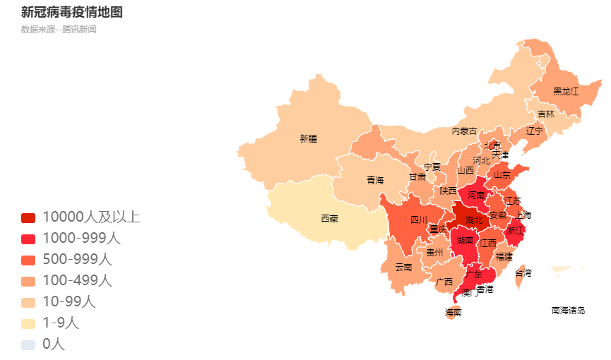

# covid-2019
使用python + flask + echarts + bootstrap绘制2019新冠肺炎疫情图，数据来源于腾讯新闻。[项目地址](http://47.107.136.2:82/)。

# 项目结构说明

| 目录/文件名称                | 说明                         |
| ---------------------------- | ---------------------------- |
| /covid-2019/                 | 项目根目录                   |
| /covid-2019/docs/            | 开发文档目录                 |
| /covid-2019/spider/          | 爬取腾讯新闻疫情数据代码目录 |
| /covid-2019/static/          | 静态文件（js & css）目录     |
| /covid-2019/templates/       | 模板（html）目录             |
| /covid-2019/.gitignore       | .gitignore文件               |
| /covid-2019/README.md        | README.md文件                |
| /covid-2019/app.py           | Flask app.py文件             |
| /covid-2019/requirements.txt | 项目依赖汇总文件             |
| /covid-2019/utils.py         | 工具库文件                   |

# 开发流程文档

/covid-2019/docs/

| 序号 | 名称                                                         |
| ---- | ------------------------------------------------------------ |
| 1    | [创建项目](https://github.com/xinhuiqin/covid-2019/blob/master/docs/1.%E5%88%9B%E5%BB%BA%E9%A1%B9%E7%9B%AE.md) |
| 2    | [使用github管理项目](https://github.com/xinhuiqin/covid-2019/blob/master/docs/2.%E4%BD%BF%E7%94%A8github%E7%AE%A1%E7%90%86%E9%A1%B9%E7%9B%AE.md) |
| 3    | [将项目部署到Linux服务器](https://github.com/xinhuiqin/covid-2019/blob/master/docs/3.%E5%B0%86%E9%A1%B9%E7%9B%AE%E9%83%A8%E7%BD%B2%E5%88%B0Linux%E6%9C%8D%E5%8A%A1%E5%99%A8.md) |
| 4    | [实时疫情显示功能开发](https://github.com/xinhuiqin/covid-2019/blob/master/docs/4.%E5%AE%9E%E6%97%B6%E7%96%AB%E6%83%85%E6%98%BE%E7%A4%BA%E5%8A%9F%E8%83%BD%E5%BC%80%E5%8F%91.md) |
| 5    | [使用爬虫爬取腾讯新闻疫情数据](https://github.com/xinhuiqin/covid-2019/blob/master/docs/5.%E7%88%AC%E8%99%AB.md) |
| 6    | [数据库开发](https://github.com/xinhuiqin/covid-2019/blob/master/docs/6.%E6%95%B0%E6%8D%AE%E5%BA%93%E5%BC%80%E5%8F%91.md) |
| 7    | [绘制疫情地图](https://github.com/xinhuiqin/covid-2019/blob/master/docs/7.%E7%BB%98%E5%88%B6%E7%96%AB%E6%83%85%E5%9C%B0%E5%9B%BE.md) |
| 8    | [绘制全国疫情趋势图](https://github.com/xinhuiqin/covid-2019/blob/master/docs/8.%E7%BB%98%E5%88%B6%E5%85%A8%E5%9B%BD%E7%96%AB%E6%83%85%E8%B6%8B%E5%8A%BF%E5%9B%BE.md) |
| 9    | [使用Nginx提供反向代理](https://github.com/xinhuiqin/covid-2019/blob/master/docs/9.%E4%BD%BF%E7%94%A8Nginx%E6%8F%90%E4%BE%9B%E5%8F%8D%E5%90%91%E4%BB%A3%E7%90%86.md) |
| 10   | [版本迭代](https://github.com/xinhuiqin/covid-2019/blob/master/docs/10.%E7%89%88%E6%9C%AC%E8%BF%AD%E4%BB%A3.md) |

