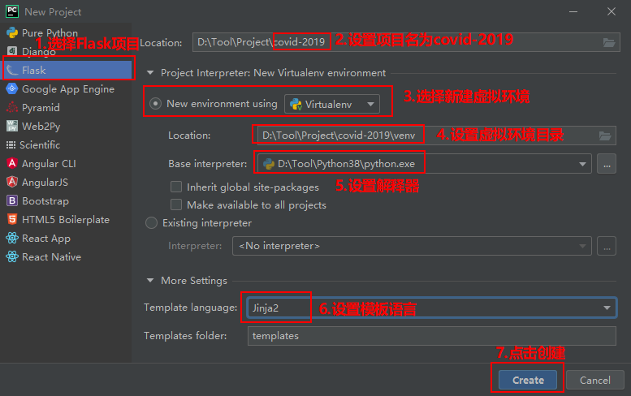
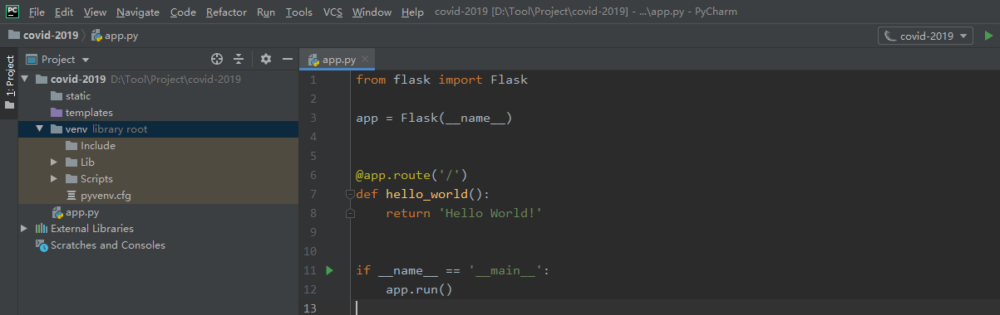
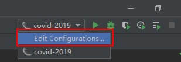
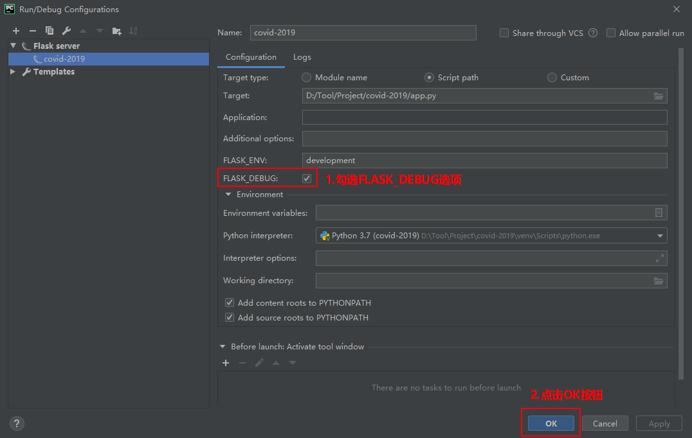
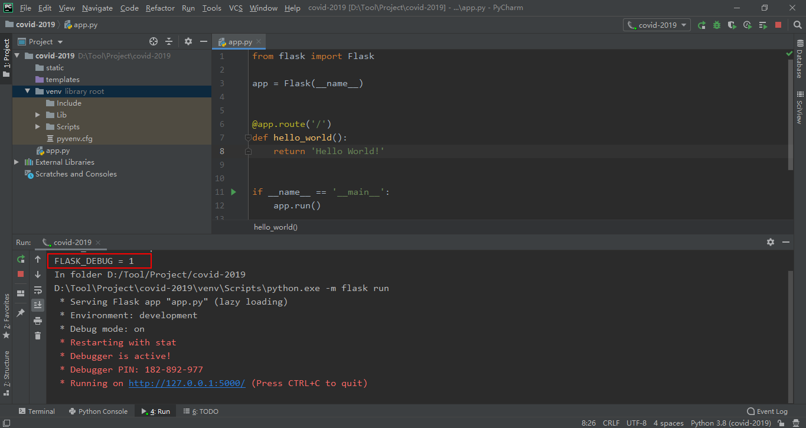

---

typora-copy-images-to: images
---

# 一、环境说明

1.windows: win10(Professional Edition)

2.python: python3.8.2

3.pycharm: PyCharm 2019.3.3 (Professional Edition)

# 二、项目创建

使用pycharm创建名为covid-2019的Flask项目（在pycharm中创建flask项目的时候，pycharm会自动将Flask下载到虚拟环境中）：



项目在pycharm中的结构如下图所示：



项目目录结构如下所示：

```
|-- covid-2019/    # 项目目录
|   |-- app.py     # app.py文件
|   |-- static/    # 静态文件目录，初始化时为空
|   |-- templates/ # 模板文件目录，初始化时为空
|   `-- venv/      # 虚拟环境目录
```

# 三、项目配置

为了方便后续的运行，我们先对项目进行相关的配置。

1、点击Edit Configuration



2、勾选FLASK_DEBUG



# 四、项目运行

为了验证项目是否创建，配置成功，我们可以点击pycharm右上方的绿色三角按钮运行项目看下效果。


如果出现如下图所示的内容，说明项目创建成功：



# 参考资料

[1]Flask：https://github.com/pallets/flask

[2]jetbrains, Creating a Flask Project:https://www.jetbrains.com/help/pycharm/creating-flask-project.html