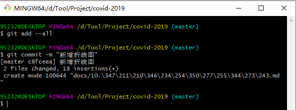
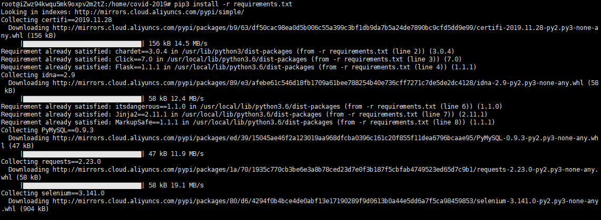
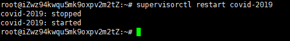

一般根据需求进行版本迭代。迭代流程分为：

# 一、本地提交代码

```
$ git add --all
$ git commit -m "新增折线图"
```



# 二、服务器拉取代码

```
root@iZwz94kwqu5mk9oxpv2m2tZ:/home/covid-2019# git pull origin master
```

# 三、服务器安装依赖

```
root@iZwz94kwqu5mk9oxpv2m2tZ:/home/covid-2019# pip3 install -r requirements.txt 
```



# 四、重启Gunicorn

```
root@iZwz94kwqu5mk9oxpv2m2tZ:~# supervisorctl restart covid-2019
```



# 五、重启Nginx

```
root@iZwz94kwqu5mk9oxpv2m2tZ:~# nginx -s reload
```


