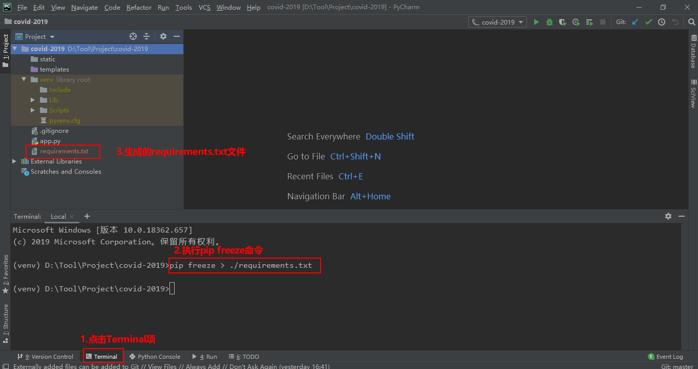
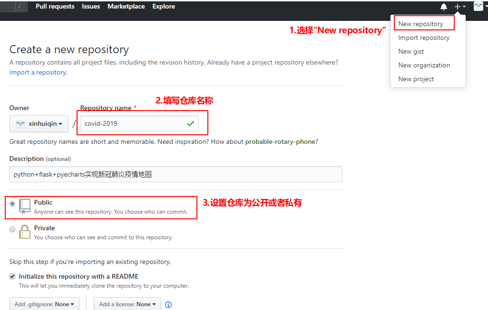
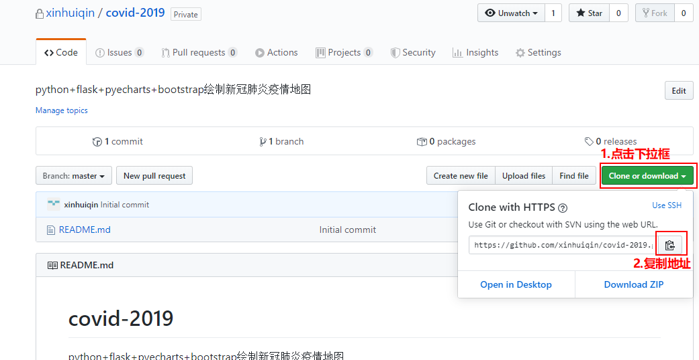

# 一、环境说明

1.windows: win10(Professional Edition)

2.python: python3.8.2

3.pycharm: PyCharm 2019.3.3 (Professional Edition)

4.git: git2.23.0

# 二、初始化版本库

进入到covid-2019目录，然后使用`git init`命令将covid-2019目录初始化为Git可以管理的版本库。这里使用的Git命令行操工具是GitBash。

```
95232@DESKTOP MINGW64 /d/Tool/Project/covid-2019
$ git init
Initialized empty Git repository in D:/Tool/Project/covid-2019/.git/
```

如上所示，初始化版本库完成。

# 三、创建.gitignore文件

在项目中有些文件是不需要提交上传的（如pycharm的.idea目录），我们可以在Git工作区的根目录（covid-2019）下创建.gitignore文件，然后把要忽略的文件名添加进去，Git就会自动忽略这些文件，不进行提交和上传。

1、创建

```
95232@DESKTOP MINGW64 /d/Tool/Project/covid-2019 (master)
$ touch .gitignore
```

2、配置

配置Python的.gitignore文件可以参考https://github.com/github/gitignore/blob/master/Python.gitignore。

打开.gitignore文件，将下列内容写入到该文件并保存（后续可以根据实际情况再补充）。

```
# pycharm相关配置文件
.idea/

# python编译文件
__pycache__/

# 虚拟环境
venv/
```

#  四、创建requirements.txt文件

requirements.txt文件是项目的依赖文件，里面记录了项目安装的依赖包，使用`pip freeze`命令生成，这里把requirements.txt文件放在项目根目录下。

```
pip freeze > ./requirements.txt
```




# 五、将项目添加到版本库

（1）git add

使用`git add`命令将项目文件添加到版本库。

```
95232@DESKTOP MINGW64 /d/Tool/Project/covid-2019 (master)
$ git add --all
```

（2）git commit 

使用`git commit`命令将项目文件提交到版本库。

```
95232@DESKTOP MINGW64 /d/Tool/Project/covid-2019 (master)
$ git commit -m "项目初始化"
[master (root-commit) 5bd01e5] 项目初始化
 2 files changed, 20 insertions(+)
 create mode 100644 .gitignore
 create mode 100644 app.py
```

# 六、添加远程仓库

1、github新建仓库covid-2019



2、复制github仓库地址



3、git remote add

先进入本地的covid-2019版本库，然后使用`git remote add`命令添加github上的covid-2019仓库。

```
95232@DESKTOP MINGW64 ~
$ cd /d/Tool/Project/covid-2019/

95232@DESKTOP MINGW64 /d/Tool/Project/covid-2019 (master)
$ git remote add origin https://github.com/xinhuiqin/covid-2019.git
```

4.git pull 

因为创建远程仓库的时候添加了一个READ文件，但是本地是没有这个文件的，为了防止从本地推送项目到github的时候覆盖掉该文件，需要先使用`git pull`命令把该文件下载到本地。

```
95232@DESKTOP MINGW64 /d/Tool/Project/covid-2019 (master)
$ git pull origin master
warning: no common commits
remote: Enumerating objects: 3, done.
remote: Counting objects: 100% (3/3), done.
remote: Compressing objects: 100% (2/2), done.
remote: Total 3 (delta 0), reused 0 (delta 0), pack-reused 0
Unpacking objects: 100% (3/3), done.
From https://github.com/xinhuiqin/covid-2019
 * branch            master     -> FETCH_HEAD
 * [new branch]      master     -> origin/master
fatal: refusing to merge unrelated histories
```

# 七、将项目上传到github

1、git push

使用`git push`命令将本地项目推送到github上。

```
95232@DESKTOP MINGW64 /d/Tool/Project/covid-2019 (master)
$ git push origin master
Enumerating objects: 10, done.
Counting objects: 100% (10/10), done.
Delta compression using up to 4 threads
Compressing objects: 100% (9/9), done.
Writing objects: 100% (9/9), 1.03 KiB | 528.00 KiB/s, done.
Total 9 (delta 2), reused 0 (delta 0)
remote: Resolving deltas: 100% (2/2), done.
To https://github.com/xinhuiqin/covid-2019.git
   83b35d7..16c040b  master -> master

```

结果如下：


注：从上面截图可以看到目前只有四个文件，因为当前的static和templates目录都是空的，所以不会被上传到github。

# 参考资料

[1]Git

官方网站：https://git-scm.com/

廖雪峰的官方网站，Git教程：https://www.liaoxuefeng.com/wiki/896043488029600

[2]github,Python.gitignore:https://github.com/github/gitignore/blob/master/Python.gitignore

[3]pip源码:https://github.com/pypa/pip