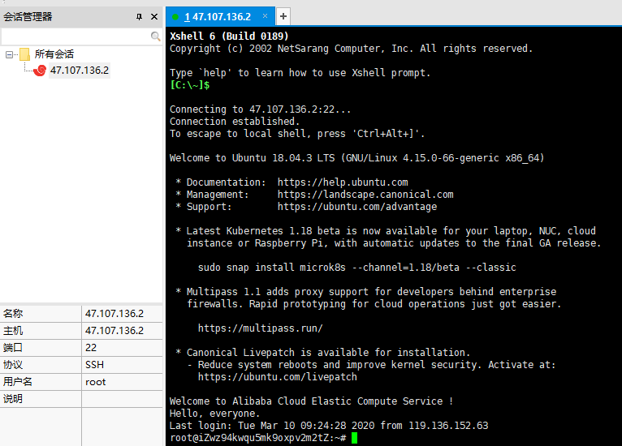
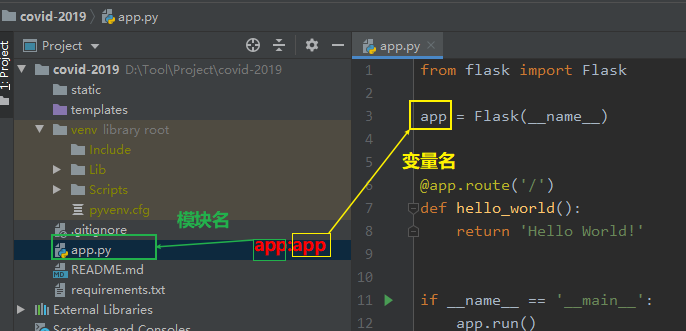

# 一、环境说明

1.windows: win10(Professional Edition)

2.python: python3.8.2

3.pycharm: PyCharm 2019.3.3 (Professional Edition)

4.git: git2.23.0

5.linux: 阿里云Ubuntu 18.04.3 LTS (GNU/Linux 4.15.0-66-generic x86_64)

6.Xshell: Xshell 6 (Build 0189)

7.Gunicorn: gunicorn (version 20.0.4)

8.supervisor: supervisor 4.1.0

# 二、连接linux服务器

这里使用Xshell连接linux服务器。连接结果如下：



# 三、克隆github仓库到Linux服务器

## 1、选择保存代码的目录(自定义)

这里把代码放到/home目录。

```
root@iZwz94kwqu5mk9oxpv2m2tZ:~# cd /home
root@iZwz94kwqu5mk9oxpv2m2tZ:/home# 
```

## 2、git clone

使用 `git clone`将github上的代码克隆到/home下。

```
root@iZwz94kwqu5mk9oxpv2m2tZ:/home# git clone https://github.com/xinhuiqin/covid-2019.git
Cloning into 'covid-2019'...
Username for 'https://github.com': xinhuiqin
Password for 'https://xinhuiqin@github.com': 
remote: Enumerating objects: 12, done.
remote: Counting objects: 100% (12/12), done.
remote: Compressing objects: 100% (9/9), done.
remote: Total 12 (delta 2), reused 9 (delta 2), pack-reused 0
Unpacking objects: 100% (12/12), done.
```

## 3、git pull

后续版本迭代使用 `git pull`从github上拉取最新代码到服务器。

```
root@iZwz94kwqu5mk9oxpv2m2tZ:/home/covid-2019# git pull origin master
```


# 四、使用Gunicorn运行程序

## 1、安装Gunicorn

```
root@iZwz94kwqu5mk9oxpv2m2tZ:~# pip3 install gunicorn
Looking in indexes: http://mirrors.cloud.aliyuncs.com/pypi/simple/
Collecting gunicorn
  Downloading http://mirrors.cloud.aliyuncs.com/pypi/packages/69/ca/926f7cd3a2014b16870086b2d0fdc84a9e49473c68a8dff8b57f7c156f43/gunicorn-20.0.4-py2.py3-none-any.whl (77 kB)
     |████████████████████████████████| 77 kB 849 kB/s 
Requirement already satisfied: setuptools>=3.0 in /usr/lib/python3/dist-packages (from gunicorn) (39.0.1)
Installing collected packages: gunicorn
Successfully installed gunicorn-20.0.4
```

## 2、安装项目依赖

（1）进入到项目根目录

```
root@iZwz94kwqu5mk9oxpv2m2tZ:~# cd /home/covid-2019/
```

（2）pip  install

使用`pip install` 命令安装项目依赖(requirements.txt)。

```
root@iZwz94kwqu5mk9oxpv2m2tZ:/home/covid-2019# pip3 install -r requirements.txt 
```

## 3、运行程序

```
root@iZwz94kwqu5mk9oxpv2m2tZ:/home/covid-2019# gunicorn --workers=4 --bind=0.0.0:8000 app:app
[2020-03-10 10:45:47 +0800] [26214] [INFO] Starting gunicorn 20.0.4
[2020-03-10 10:45:47 +0800] [26214] [INFO] Listening at: http://0.0.0.0:8000 (26214)
[2020-03-10 10:45:47 +0800] [26214] [INFO] Using worker: sync
[2020-03-10 10:45:47 +0800] [26217] [INFO] Booting worker with pid: 26217
[2020-03-10 10:45:47 +0800] [26218] [INFO] Booting worker with pid: 26218
[2020-03-10 10:45:47 +0800] [26219] [INFO] Booting worker with pid: 26219
[2020-03-10 10:45:47 +0800] [26220] [INFO] Booting worker with pid: 26220
```

说明：

（1）--workers: --workers选项定义worker(工作线程)的数量。通常，workers的数量建议为(2*CPU核数)+1

（2）--bind: Gunicorn默认监听linux主机的8000端口。为了能够在外部访问，使用--bind选项来指定主机的地址为0.0.0.0，端口为8000。

（3）gunicorn运行程序的命令格式为：

```
$gunicorn [OPTIONS] 模块名:变量名
```

所以app:app中的含义如下：



## 4、运行结果

打开浏览器，通过服务器的公网IP（如：http://47.107.136.2:8000/）即可访问：


# 五、使用supervisor管理进程

直接通过命令来运行gunicorn并不十分可靠，可以使用supervisor这个工具进行监控和管理。

## 1、安装supervisor

```
root@iZwz94kwqu5mk9oxpv2m2tZ:~# apt install supervisor
```

## 2、创建配置文件

```
root@iZwz94kwqu5mk9oxpv2m2tZ:~# touch /etc/supervisor/conf.d/covid-2019.conf
```

## 3、编写配置文件

将下列内容写到 `/etc/supervisor/conf.d/covid-2019.conf`文件。

```
[program:covid-2019]
command=gunicorn --workers=4 --bind=0.0.0.0:8000 app:app
directory=/home/covid-2019
autostart=true
autorestart=true
stopasgroup=true
killasgroup=true
```

## 4、启动和停止supervisor

```
# 启动
root@iZwz94kwqu5mk9oxpv2m2tZ:~# service supervisor start
# 停止
root@iZwz94kwqu5mk9oxpv2m2tZ:~# service supervisor stop
```

## 5、supervisorctl

supervisor提供命令行工具supervisorctl来查看和操作相关程序。所以也可以使用supervisorctl来启动和停止supervisor。

```
# 启动
root@iZwz94kwqu5mk9oxpv2m2tZ:~# supervisorctl start  covid-2019
covid-2019: started
# 停止
root@iZwz94kwqu5mk9oxpv2m2tZ:~# supervisorctl stop covid-2019
covid-2019: stopped
```

# 参考资料

[1] Xshell官网: https://www.netsarang.com/zh/xshell/

[2] Gunicorn

官网: https://gunicorn.org/

源码：https://github.com/benoitc/gunicorn

[3]supervisor:http://supervisord.org/