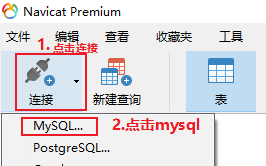
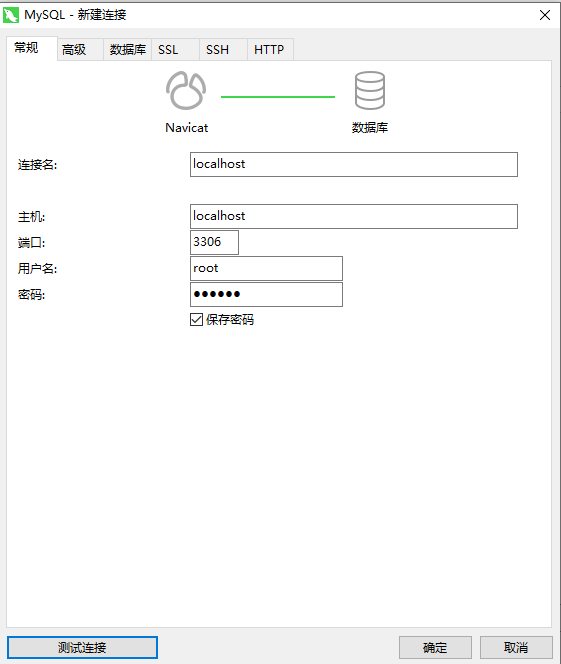
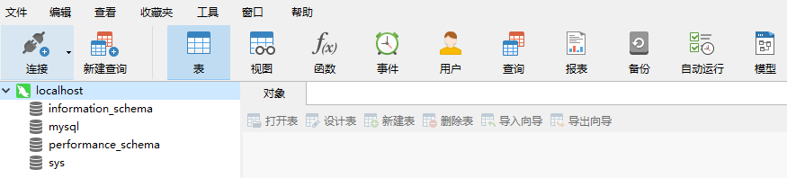
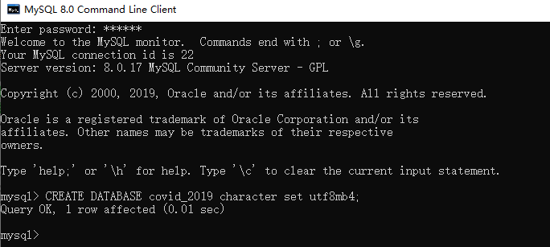
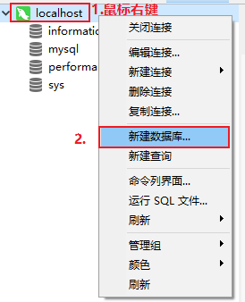
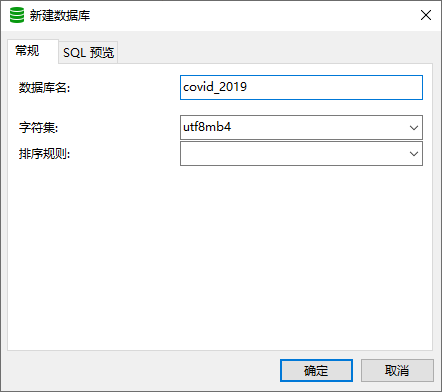
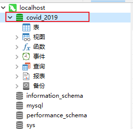
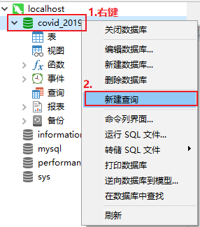

# 一、环境说明

1.MySQL: 8.0.17 MySQL Community Server - GPL

2.Navicat: 12.1.20(64-bit) - Premium

# 安装MySQL

安装MySQL步骤参考https://dev.mysql.com/doc/refman/8.0/en/windows-installation.html。

# Navicat

## 1、安装

安装Navicat步骤参考：https://www.navicat.com/manual/online_manual_new/en/navicat/win_manual/#/installation。

## 2、创建连接

Navicat安装好后，就可以连接本地MySQL服务器了。连接步骤如下：

（1）启动navicat，点击:连接-MySQL



（2）根据提示输入用户名、密码等信息，最后点击确定。



（3）连接完成后，双击localhost打开连接。



# 创建数据库covid_2019

## 1、方式一：MySQL命令行客户端创建

首先启动MySQL8.0 Command Line Client，然后创建名为covid_2019的数据库用于存储数据。

```
mysql> CREATE DATABASE covid_2019 character set utf8mb4;
Query OK, 1 row affected (0.01 sec)
```



##  2、方式二：Navicat创建

（1）选择新建数据库



（2）填写数据库名称，选择字符集



（3）创建结果



# 中国每日数据汇总表

中国每日数据汇总表(china_day_list)。

因为创建表的代码比较多，在MySQL8.0 Command Line Client操作并不方便，所以在navicat里面写。

（1）新建查询



（2）输入代码（15个字段）

```
CREATE TABLE china_day_list(
ds DATE NOT NULL PRIMARY KEY COMMENT '日期',
confirm INT NOT NULL COMMENT '累计确诊', 
suspect INT NOT NULL COMMENT '现有疑似',
dead INT NOT NULL COMMENT '累计死亡', 
heal INT NOT NULL COMMENT '累计治愈', 
now_confirm INT NOT NULL COMMENT '当前确诊',
now_severe INT NOT NULL COMMENT '当前重症',
imported_case INT NOT NULL COMMENT '累计输入病例',
dead_rate FLOAT NOT NULL COMMENT '死亡率',
heal_rate FLOAT NOT NULL COMMENT '治愈率',
add_confirm INT NOT NULL COMMENT '新增确诊', 
add_suspect INT NOT NULL COMMENT '新增疑似',
add_dead INT NOT NULL COMMENT '新增死亡', 
add_heal INT NOT NULL COMMENT '新增治愈',
add_imported_case INT NOT NULL COMMENT '新增输入病例'
);
```

（3）运行代码

（4）创建结果

运行代码后数据库不会自动显示新建的表，需要鼠标左键点击covid_2019数据库，然后数据右键点击刷新即可显示新建的表。

#  省市每日数据汇总表

省市每日数据汇总表（province_day_list）。

## 1、创建表

```
# 省市每日汇总数据
CREATE TABLE provience_day_list(
id INT NOT NULL AUTO_INCREMENT PRIMARY KEY,
provience VARCHAR(50) NOT NULL COMMENT '省',
city VARCHAR(50) NOT NULL COMMENT '市',
confirm INT NOT NULL COMMENT '累计确诊',
confirm_add INT NOT NULL COMMENT '新增确诊',
heal INT NOT NULL COMMENT '累计治愈',
dead INT NOT NULL COMMENT '累计死亡',
update_time DATETIME NOT NULL COMMENT '数据最后更新时间',
);
```

# 参考资料

[1]MySQL官方文档，