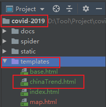

# 开发环境说明

详见前面的文档。

# 图分析

## 1、“疫情新增”趋势图

“全国疫情新增趋势”图统计全国每日新增确诊，新增疑似两个字段的数据。

## 2、“确诊/疑似/重症”趋势图

“全国确诊/疑似/重症”图统计的的是累计确诊，现有确诊，现有疑似，现有重症四个字段的数据。

## 3、“累计治愈/死亡”趋势图

“全国累计治愈/死亡”趋势图统计累计治愈，累计死亡两个字段的数据。

## 4、“治愈率/病死率”趋势图

“全国治愈率/病死率”趋势图统计的是累计治愈率，累计病死率两个字段的数据。

这些图的日期都使用“月份-日期”格式。都使用折线图绘制。

# 开发流程

## 1、创建模板

在covid-2019/templates/目录下创建名为chinaTrend.thml的模板，用于展示“全国疫情新增趋势”，“全国确诊/疑似/重症”， “全国累计治愈/死亡”， “治愈率死亡率”等四张图。

创建完成后，文件目录结构如下图所示：

## 2、编写视图函数

编写视图函数，将所需要的数据查询出来并传递给前端模板。详见 `covid-2019/app.py`文件里的china_trend()函数。

## 3、模板开发

前端模板获得数据后，将数据用于Echarts的折线图。详见`covid-2019\templates\chinaTrend.html`文件。

# 参考资料

[1] Echarts: https://www.echartsjs.com/

[2]Echarts Line:https://www.echartsjs.com/zh/option.html#series-line