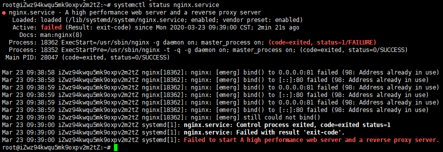
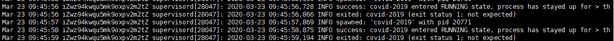
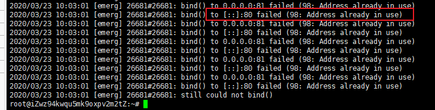

# 开发环境说明

# Nginx&Gnicorn&Flask的关系

Nginx是web服务器，监听来自外部的请求，Gunicorn运行Flask应用。

Nginx将客户端的http请求转发给Gunicorn, Gunicorn再转发给Flask应用处理。

处理得到结果后再返回给Nginx,Nginx再返回给客户端。

# 安装Nginx

```
root@iZwz94kwqu5mk9oxpv2m2tZ:~# sudo apt install nginx
```

这里使用Ubuntu的 `apt` 命令的方式进行安装Nginx。安装完成后，按照Linux系统的目录结构设计:

（1）Nginx相关文件会放置在目录：`/etc/nginx`

（2）Nginx默认配置文件路径：`/etc/nginx/nginx.conf`

（2）Nginx二进制文件（命令）文件路径：`/etc/usr/sbin/nginx`

# 创建项目的Nginx配置文件

当我们启动Nginx的时候，和Gunicorn并没有关联上，我们应该写一段代码让Nginx和Gunicorn关联上。那么这段代码写在哪里？


当Nginx启动的时候，会加载Nginx默认的配置文件`/etc/nginx/nginx.conf`，所以我们可以把让Nginx和Gunicorn关联的代码写在这个文件里，这样Nginx运行的时候就和Gunicorn关联上了。但是，一般来说，项目可能有多个，如果每个项目的配置都写到这个文件里，那么就会显得很乱，不方便管理。为了方便管理，一般为每个项目创建单独的Nginx配置文件。那么，这个配置文件又放到哪里？


打开`/etc/nginx/nginx.conf`文件，我们可以看到里面有两行代码：

```
 include /etc/nginx/conf.d/*.conf;
 include /etc/nginx/sites-enabled/*;
```

这两行代码表示把`/etc/nginx/conf.d/`目录下所有以.conf结尾的文件，把`/etc/nginx/sites-enabled/`目录下所有的文件都包含到其中。即启动Nginx，加载`/etc/nginx/nginx.conf`文件的时候也会运行这些被包含的文件。这里我们把项目的Nginxi配置文件创建到`/etc/nginx/sites-enabled/`目录下，并且命名未covid-2019。

```
root@iZwz94kwqu5mk9oxpv2m2tZ:~# sudo touch /etc/nginx/sites-enabled/covid-2019
```

配置文件创建完了，那么让Nginx和Gunicorn关联的代码怎么写呢？


部署Gunicorn的Nginx配置文件可以参考Gunicorn官方文档给出的示例：https://docs.gunicorn.org/en/stable/deploy.html#nginx-configuration，项目的具体配置代码如下：

```
server {
    listen 80; # 监听客户端请求
    server_name www.sweeneys.cn; # IP映射的域名，如果没有域名可以去掉该行
    access_log /var/log/nginx/covid-2019/access.log; # 项目nginx的访问日志
    error_log  /var/log/nginx/covid-2019/error.log; # 项目nginx的错误日志

    location / {
		proxy_pass http://127.0.0.1:8000; # Nginx转发地址，即Gunicorn运行的地址，也可以设置为其它的端口	
    }

    location /static { # 如果用户访问的形式是http://www.sweeneys.cn/static，那么该模块处理
		alias /home/covid-2019/static;
    }
}
```

# 检查项目的Nginx配置文件

在写完配置文件后，我们可以使用`nginx -t`命令检查项目的Ngix配置文件是否书写正确。

```
root@iZwz94kwqu5mk9oxpv2m2tZ:~# sudo nginx -t
nginx: the configuration file /etc/nginx/nginx.conf syntax is ok
nginx: configuration file /etc/nginx/nginx.conf test is successful
```

如上所示，表示项目的Nginx配置文件书写正确。接下来就可以启动Nginx了。

# 启动Nginx

首次启动可以使用命令：nginx

```
root@iZwz94kwqu5mk9oxpv2m2tZ:~# nginx
```

启动后的重启可以使用`nginx -s reload`命令。

```
root@iZwz94kwqu5mk9oxpv2m2tZ:~# nginx -s reload
```

# Nginx可能错误

## 1、 nginx.service failed

```
root@iZwz94kwqu5mk9oxpv2m2tZ:~# service nginx start
Job for nginx.service failed because the control process exited with error code.
See "systemctl status nginx.service" and "journalctl -xe" for details.
```

（1）按照提示输入`systemctl status nginx.service`：

```
root@iZwz94kwqu5mk9oxpv2m2tZ:~# systemctl status nginx.service
```



看完之后也没说具体在哪发生了错误。

（2）继续输入`journalctl -xe`:

```
root@iZwz94kwqu5mk9oxpv2m2tZ:~# journalctl -xe
```



也没看出错误在哪里，按Ctrl+C 退出该日志。

（3）查看nginx的错误日志

`cat` 命令：将文件的内容从头到尾连续打印在屏幕上。

```
root@iZwz94kwqu5mk9oxpv2m2tZ:~# cat /var/log/nginx/error.log
```



 提示80端口被占用。

（4）查看占用80端口的进程

```
root@iZwz94kwqu5mk9oxpv2m2tZ:~# ps -ef | grep nginx
www-data  8954 28208  0  2019 ?        00:00:01 nginx: worker process
root     28208     1  0  2019 ?        00:00:00 nginx: master process /usr/sbin/nginx
root     31357 14600  0 10:16 pts/1    00:00:00 grep --color=auto nginx

```

（5）结束进程

 使用 `kill`命令结束进程，语法为`kill -signal PID`。

```
kill -9 28028 
```

## 2、nginx: [error] invalid PID number "" in "/run/nginx.pid"

# 参考资料

[1] Nginx官网文档：http://nginx.org/en/docs/

[2]Gunicorn官方文档：https://docs.gunicorn.org/en/stable/